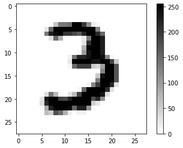
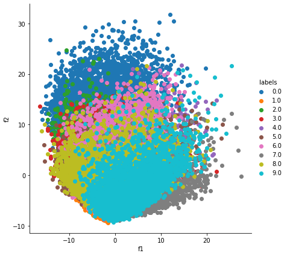
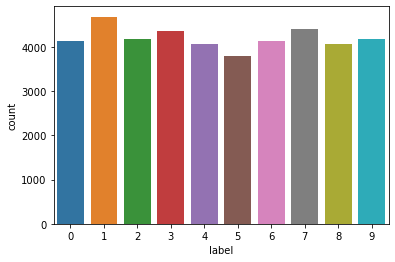
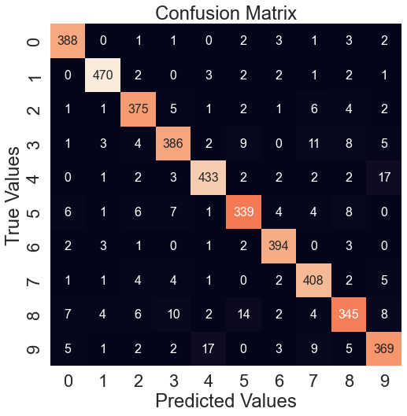
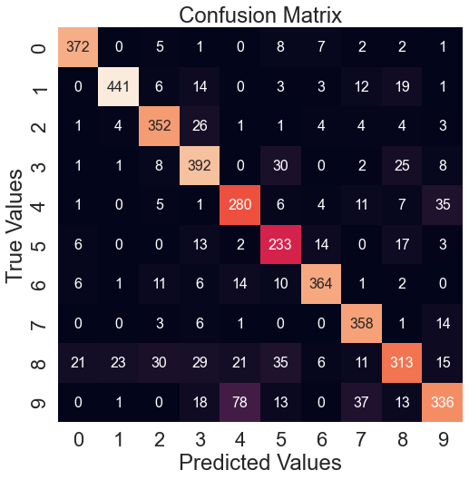
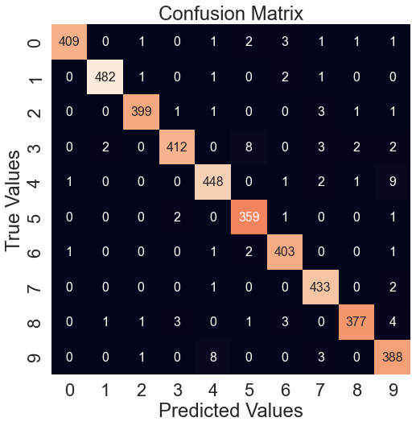
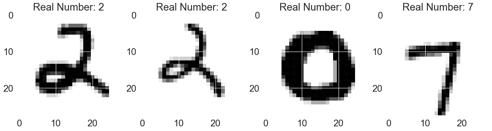
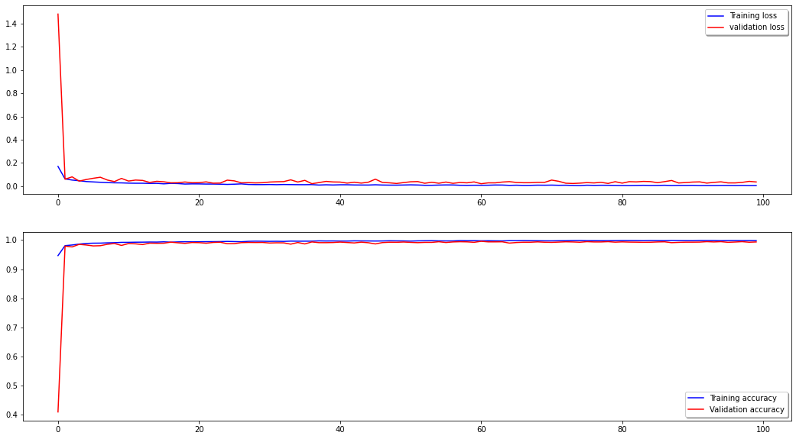
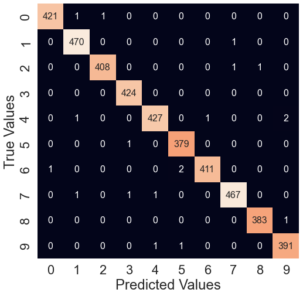
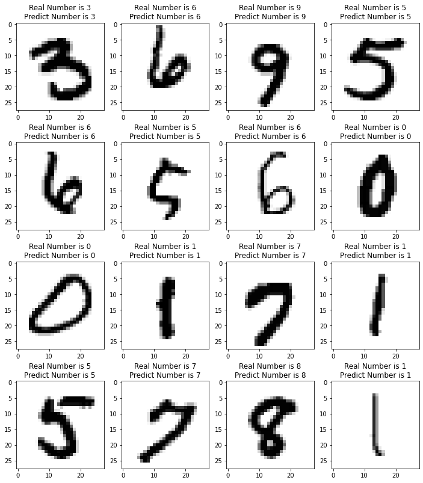

# machine-learning-digit-recognizer

MNIST Digit Recognizer with Machine Learning

https://www.kaggle.com/competitions/digit-recognizer

## Keşifsel Veri Analizi (EDA) ve Derin Öğrenme Modeli

Proje kapsamında MNIST veri seti için keşifsel veri analizi aşağıdaki gibi yapılmıştır. Veri işleyiş yöntemleri burada görülebilir. Ayrıca scikit-learn kütüphanesindeki MLP (Multi-layer Perceptron) Classifier modeli ile veriler eğitilmiş ve %99.7 tahmin doğruluğuna ulaşılmıştır.


```python
import pandas as pd
import numpy as np
import matplotlib.pyplot as plt
import seaborn as sns

test = pd.read_csv('test.csv')
train = pd.read_csv('train.csv')

train.head()
```


<div>
<table border="1" class="dataframe">
  <thead>
    <tr style="text-align: right;">
      <th></th>
      <th>label</th>
      <th>pixel0</th>
      <th>pixel1</th>
      <th>pixel2</th>
      <th>pixel3</th>
      <th>pixel4</th>
      <th>pixel5</th>
      <th>pixel6</th>
      <th>pixel7</th>
      <th>pixel8</th>
      <th>...</th>
      <th>pixel774</th>
      <th>pixel775</th>
      <th>pixel776</th>
      <th>pixel777</th>
      <th>pixel778</th>
      <th>pixel779</th>
      <th>pixel780</th>
      <th>pixel781</th>
      <th>pixel782</th>
      <th>pixel783</th>
    </tr>
  </thead>
  <tbody>
    <tr>
      <th>0</th>
      <td>1</td>
      <td>0</td>
      <td>0</td>
      <td>0</td>
      <td>0</td>
      <td>0</td>
      <td>0</td>
      <td>0</td>
      <td>0</td>
      <td>0</td>
      <td>...</td>
      <td>0</td>
      <td>0</td>
      <td>0</td>
      <td>0</td>
      <td>0</td>
      <td>0</td>
      <td>0</td>
      <td>0</td>
      <td>0</td>
      <td>0</td>
    </tr>
    <tr>
      <th>1</th>
      <td>0</td>
      <td>0</td>
      <td>0</td>
      <td>0</td>
      <td>0</td>
      <td>0</td>
      <td>0</td>
      <td>0</td>
      <td>0</td>
      <td>0</td>
      <td>...</td>
      <td>0</td>
      <td>0</td>
      <td>0</td>
      <td>0</td>
      <td>0</td>
      <td>0</td>
      <td>0</td>
      <td>0</td>
      <td>0</td>
      <td>0</td>
    </tr>
    <tr>
      <th>2</th>
      <td>1</td>
      <td>0</td>
      <td>0</td>
      <td>0</td>
      <td>0</td>
      <td>0</td>
      <td>0</td>
      <td>0</td>
      <td>0</td>
      <td>0</td>
      <td>...</td>
      <td>0</td>
      <td>0</td>
      <td>0</td>
      <td>0</td>
      <td>0</td>
      <td>0</td>
      <td>0</td>
      <td>0</td>
      <td>0</td>
      <td>0</td>
    </tr>
    <tr>
      <th>3</th>
      <td>4</td>
      <td>0</td>
      <td>0</td>
      <td>0</td>
      <td>0</td>
      <td>0</td>
      <td>0</td>
      <td>0</td>
      <td>0</td>
      <td>0</td>
      <td>...</td>
      <td>0</td>
      <td>0</td>
      <td>0</td>
      <td>0</td>
      <td>0</td>
      <td>0</td>
      <td>0</td>
      <td>0</td>
      <td>0</td>
      <td>0</td>
    </tr>
    <tr>
      <th>4</th>
      <td>0</td>
      <td>0</td>
      <td>0</td>
      <td>0</td>
      <td>0</td>
      <td>0</td>
      <td>0</td>
      <td>0</td>
      <td>0</td>
      <td>0</td>
      <td>...</td>
      <td>0</td>
      <td>0</td>
      <td>0</td>
      <td>0</td>
      <td>0</td>
      <td>0</td>
      <td>0</td>
      <td>0</td>
      <td>0</td>
      <td>0</td>
    </tr>
  </tbody>
</table>
<p>5 rows × 785 columns</p>
</div>


```python
train.describe()
```


<div>
<table border="1" class="dataframe">
  <thead>
    <tr style="text-align: right;">
      <th></th>
      <th>label</th>
      <th>pixel0</th>
      <th>pixel1</th>
      <th>pixel2</th>
      <th>pixel3</th>
      <th>pixel4</th>
      <th>pixel5</th>
      <th>pixel6</th>
      <th>pixel7</th>
      <th>pixel8</th>
      <th>...</th>
      <th>pixel774</th>
      <th>pixel775</th>
      <th>pixel776</th>
      <th>pixel777</th>
      <th>pixel778</th>
      <th>pixel779</th>
      <th>pixel780</th>
      <th>pixel781</th>
      <th>pixel782</th>
      <th>pixel783</th>
    </tr>
  </thead>
  <tbody>
    <tr>
      <th>count</th>
      <td>42000.000000</td>
      <td>42000.0</td>
      <td>42000.0</td>
      <td>42000.0</td>
      <td>42000.0</td>
      <td>42000.0</td>
      <td>42000.0</td>
      <td>42000.0</td>
      <td>42000.0</td>
      <td>42000.0</td>
      <td>...</td>
      <td>42000.000000</td>
      <td>42000.000000</td>
      <td>42000.000000</td>
      <td>42000.00000</td>
      <td>42000.000000</td>
      <td>42000.000000</td>
      <td>42000.0</td>
      <td>42000.0</td>
      <td>42000.0</td>
      <td>42000.0</td>
    </tr>
    <tr>
      <th>mean</th>
      <td>4.456643</td>
      <td>0.0</td>
      <td>0.0</td>
      <td>0.0</td>
      <td>0.0</td>
      <td>0.0</td>
      <td>0.0</td>
      <td>0.0</td>
      <td>0.0</td>
      <td>0.0</td>
      <td>...</td>
      <td>0.219286</td>
      <td>0.117095</td>
      <td>0.059024</td>
      <td>0.02019</td>
      <td>0.017238</td>
      <td>0.002857</td>
      <td>0.0</td>
      <td>0.0</td>
      <td>0.0</td>
      <td>0.0</td>
    </tr>
    <tr>
      <th>std</th>
      <td>2.887730</td>
      <td>0.0</td>
      <td>0.0</td>
      <td>0.0</td>
      <td>0.0</td>
      <td>0.0</td>
      <td>0.0</td>
      <td>0.0</td>
      <td>0.0</td>
      <td>0.0</td>
      <td>...</td>
      <td>6.312890</td>
      <td>4.633819</td>
      <td>3.274488</td>
      <td>1.75987</td>
      <td>1.894498</td>
      <td>0.414264</td>
      <td>0.0</td>
      <td>0.0</td>
      <td>0.0</td>
      <td>0.0</td>
    </tr>
    <tr>
      <th>min</th>
      <td>0.000000</td>
      <td>0.0</td>
      <td>0.0</td>
      <td>0.0</td>
      <td>0.0</td>
      <td>0.0</td>
      <td>0.0</td>
      <td>0.0</td>
      <td>0.0</td>
      <td>0.0</td>
      <td>...</td>
      <td>0.000000</td>
      <td>0.000000</td>
      <td>0.000000</td>
      <td>0.00000</td>
      <td>0.000000</td>
      <td>0.000000</td>
      <td>0.0</td>
      <td>0.0</td>
      <td>0.0</td>
      <td>0.0</td>
    </tr>
    <tr>
      <th>25%</th>
      <td>2.000000</td>
      <td>0.0</td>
      <td>0.0</td>
      <td>0.0</td>
      <td>0.0</td>
      <td>0.0</td>
      <td>0.0</td>
      <td>0.0</td>
      <td>0.0</td>
      <td>0.0</td>
      <td>...</td>
      <td>0.000000</td>
      <td>0.000000</td>
      <td>0.000000</td>
      <td>0.00000</td>
      <td>0.000000</td>
      <td>0.000000</td>
      <td>0.0</td>
      <td>0.0</td>
      <td>0.0</td>
      <td>0.0</td>
    </tr>
    <tr>
      <th>50%</th>
      <td>4.000000</td>
      <td>0.0</td>
      <td>0.0</td>
      <td>0.0</td>
      <td>0.0</td>
      <td>0.0</td>
      <td>0.0</td>
      <td>0.0</td>
      <td>0.0</td>
      <td>0.0</td>
      <td>...</td>
      <td>0.000000</td>
      <td>0.000000</td>
      <td>0.000000</td>
      <td>0.00000</td>
      <td>0.000000</td>
      <td>0.000000</td>
      <td>0.0</td>
      <td>0.0</td>
      <td>0.0</td>
      <td>0.0</td>
    </tr>
    <tr>
      <th>75%</th>
      <td>7.000000</td>
      <td>0.0</td>
      <td>0.0</td>
      <td>0.0</td>
      <td>0.0</td>
      <td>0.0</td>
      <td>0.0</td>
      <td>0.0</td>
      <td>0.0</td>
      <td>0.0</td>
      <td>...</td>
      <td>0.000000</td>
      <td>0.000000</td>
      <td>0.000000</td>
      <td>0.00000</td>
      <td>0.000000</td>
      <td>0.000000</td>
      <td>0.0</td>
      <td>0.0</td>
      <td>0.0</td>
      <td>0.0</td>
    </tr>
    <tr>
      <th>max</th>
      <td>9.000000</td>
      <td>0.0</td>
      <td>0.0</td>
      <td>0.0</td>
      <td>0.0</td>
      <td>0.0</td>
      <td>0.0</td>
      <td>0.0</td>
      <td>0.0</td>
      <td>0.0</td>
      <td>...</td>
      <td>254.000000</td>
      <td>254.000000</td>
      <td>253.000000</td>
      <td>253.00000</td>
      <td>254.000000</td>
      <td>62.000000</td>
      <td>0.0</td>
      <td>0.0</td>
      <td>0.0</td>
      <td>0.0</td>
    </tr>
  </tbody>
</table>
<p>8 rows × 785 columns</p>
</div>


```python
train.shape
```


    (42000, 785)


```python
# veri temizleme
train.isna().any().any()

# veri ve etiketlerini alma
train_data = train.loc[:, "pixel0":]
train_label = train.loc[:, "label"]

# verileri normalize etme
train_data = train_data/255.0
test = test/255.0
```

Veri setindeki örnek bir rakam veriler normalize edildikten sonra aşağıdaki gibi elde edilmiştir.


```python
digit_array = train.loc[9, "pixel0":]
arr = np.array(digit_array) 

image_array = np.reshape(arr, (28,28))

digit_img = plt.imshow(image_array, cmap=plt.cm.binary)
plt.colorbar(digit_img)
print("Image Label: {}".format(train.loc[9, "label"]))
```

    Image Label: 3


    

    


Veri standardizasyonu;


```python
from sklearn.preprocessing import StandardScaler

standardized_scalar = StandardScaler()
standardized_data = standardized_scalar.fit_transform(train_data)
standardized_data.shape
```


    (42000, 784)


Kovaryans matrisi;


```python
cov_matrix = np.matmul(standardized_data.T, standardized_data)
cov_matrix.shape
```


    (784, 784)


Özdeğer ve Özvektörler;


```python
from scipy.linalg import eigh

lambdas, vectors = eigh(cov_matrix, eigvals=(782, 783))
vectors.shape
```


    (784, 2)


```python
vectors = vectors.T
vectors.shape
```


    (2, 784)


Birim vektörler;


```python
new_coordinates = np.matmul(vectors, standardized_data.T)
print(new_coordinates.shape)
new_coordinates = np.vstack((new_coordinates, train_label)).T
```

    (2, 42000)


```python
df_new = pd.DataFrame(new_coordinates, columns=["f1", "f2", "labels"])
df_new.head()
```


<div>
<table border="1" class="dataframe">
  <thead>
    <tr style="text-align: right;">
      <th></th>
      <th>f1</th>
      <th>f2</th>
      <th>labels</th>
    </tr>
  </thead>
  <tbody>
    <tr>
      <th>0</th>
      <td>-5.226445</td>
      <td>-5.140478</td>
      <td>1.0</td>
    </tr>
    <tr>
      <th>1</th>
      <td>6.032996</td>
      <td>19.292332</td>
      <td>0.0</td>
    </tr>
    <tr>
      <th>2</th>
      <td>-1.705813</td>
      <td>-7.644503</td>
      <td>1.0</td>
    </tr>
    <tr>
      <th>3</th>
      <td>5.836139</td>
      <td>-0.474207</td>
      <td>4.0</td>
    </tr>
    <tr>
      <th>4</th>
      <td>6.024818</td>
      <td>26.559574</td>
      <td>0.0</td>
    </tr>
  </tbody>
</table>
</div>


Veri dağılımı;


```python
sns.FacetGrid(df_new, hue="labels", height=6).map(plt.scatter, "f1", "f2").add_legend()
plt.show()
```


    

    


Veri histogramı;

Veri setinde diğerlerinden daha fazla sayıda 1 olduğu görülüyor.


```python
sns.countplot(train.label)
print(list(train.label.value_counts().sort_index()))
```

    [4132, 4684, 4177, 4351, 4072, 3795, 4137, 4401, 4063, 4188]


    /opt/homebrew/Caskroom/miniforge/base/envs/tf_m1/lib/python3.8/site-packages/seaborn/_decorators.py:36: FutureWarning: Pass the following variable as a keyword arg: x. From version 0.12, the only valid positional argument will be `data`, and passing other arguments without an explicit keyword will result in an error or misinterpretation.
      warnings.warn(


    

    


## Multi-Layer Perceptron Classifier Derin Öğrenme Modeli ile Veri Eğitimi ve Sonuçları

Görüleceği üzere tahmin oranı %99.7 olarak çıkıyor.


```python
x = train.drop(['label'],axis=1).values
y = train['label'].values.flatten()

from sklearn.model_selection import train_test_split
x_train,x_dev, y_train,  y_dev = train_test_split(x,y,random_state=42)

from sklearn.neural_network import MLPClassifier
from sklearn.metrics import classification_report
import scipy

clf = MLPClassifier(solver='lbfgs',hidden_layer_sizes=(1000,),  random_state=1 ) 
best_model = clf.fit(x/255.0, y)

train['label_predicted'] =  best_model.predict(x/255.0)
train['valid_predicted'] = train.apply(lambda row: row['label_predicted']==row['label'], axis=1)

print('Training Accuracy: {:3.2f} %'.format(best_model.score(x,y)*100))
y_test_pred = best_model.predict(x)

```

    Training Accuracy: 99.70 %


```python
from sklearn.metrics import confusion_matrix
mat = confusion_matrix(y, y_test_pred)
fig = plt.figure(figsize=(8,8))

sns.set(font_scale=2)
sns.heatmap(mat.T, annot=True, cbar = False, annot_kws={'size': 16}, fmt='.0f')
    
plt.title("Confusion Matrix")
plt.xlabel('Predicted Values')
plt.ylabel('True Values')
plt.show()

from sklearn.metrics import accuracy_score
print("Test Accuracy: " + accuracy_score(y, y_test_pred).__str__())
```


    

    


    Test Accuracy: 0.9970238095238095


Yukarıda görülen confusion matriste değerler ne kadar orta çaprazda toplanırsa o kadar doğru tahmin yaptığımızı gösteriyor ve bakıldığında, köşelerin 0 ya da 0'a çok yakın değerler olduğu ve bu da uygulamış olduğumuz MLP Classifier algoritmasının verilerimiz için gayet iyi çalıştığını gösteriyor.

## MNIST KNN


```python
import numpy as np
import pandas as pd
import matplotlib.pyplot as plt
import seaborn as sns
from sklearn.model_selection import train_test_split
```


```python
test = pd.read_csv('test.csv')
train = pd.read_csv('train.csv')
```


```python
x_Train=train.drop(labels="label",axis=1)
y_Train=train["label"]
```


```python
x_Train=x_Train/255
x_Test=test/255
x_Train=x_Train.values.reshape(-1,28,28,1)
x_Test=x_Test.values.reshape(-1,28,28,1)
print("x train shape",x_Train.shape)
print("x test shape",x_Test.shape)
```

    x train shape (42000, 28, 28, 1)
    x test shape (28000, 28, 28, 1)


```python
X_train, X_val, ml_train, ml_val = train_test_split(x_Train, y_Train, test_size = 0.1, random_state=2)
```


```python
from tensorflow.keras.utils import to_categorical
Y_train=to_categorical(y_Train,num_classes=10)
```


```python
X_train, X_val, Y_train, Y_val = train_test_split(x_Train, Y_train, test_size = 0.1, random_state=2)
print("x_train shape",X_train.shape)
print("x_val shape",X_val.shape)
print("y_train shape",Y_train.shape)
print("y_val shape",Y_val.shape)
```

    x_train shape (37800, 28, 28, 1)
    x_val shape (4200, 28, 28, 1)
    y_train shape (37800, 10)
    y_val shape (4200, 10)


```python
from sklearn.neighbors import KNeighborsClassifier
knn = KNeighborsClassifier(n_neighbors=3)
knn.fit(train_x, ml_train)
train_accuracy = knn.score(train_x, ml_train)
test_accuracy = knn.score(test_x, ml_val) 
print(train_accuracy)
print(test_accuracy)
y_pred = knn.predict(test_x)
```

    0.9902380952380953
    0.9826190476190476


```python
from sklearn.metrics import confusion_matrix
mat = confusion_matrix(ml_val,y_pred)
fig = plt.figure(figsize=(8,8))

sns.set(font_scale=2)
sns.heatmap(mat.T, annot=True, cbar = False, annot_kws={'size': 16}, fmt='.0f')
    
plt.title("Confusion Matrix")
plt.xlabel('Predicted Values')
plt.ylabel('True Values')
plt.show()

from sklearn.metrics import accuracy_score
print("Accuracy: " + accuracy_score(ml_val,y_pred).__str__())
```


    

    


    Accuracy: 0.929047619047619

## MNIST Decision Tree


```python
import numpy as np
import pandas as pd
import matplotlib.pyplot as plt
import seaborn as sns
from sklearn.model_selection import train_test_split
```


```python
test = pd.read_csv('test.csv')
train = pd.read_csv('train.csv')
```


```python
x_Train=train.drop(labels="label",axis=1)
y_Train=train["label"]
```


    0    1
    1    0
    2    1
    3    4
    4    0
    5    0
    6    7
    7    3
    8    5
    9    3
    Name: label, dtype: int64


```python
x_Train=x_Train/255
x_Test=test/255
x_Train=x_Train.values.reshape(-1,28,28,1)
x_Test=x_Test.values.reshape(-1,28,28,1)
print("x train shape",x_Train.shape)
print("x test shape",x_Test.shape)
```

    x train shape (42000, 28, 28, 1)
    x test shape (28000, 28, 28, 1)


```python
X_train, X_val, ml_train, ml_val = train_test_split(x_Train, y_Train, test_size = 0.1, random_state=2)
```


```python
from tensorflow.keras.utils import to_categorical
Y_train=to_categorical(y_Train,num_classes=10)
```


```python
X_train, X_val, Y_train, Y_val = train_test_split(x_Train, Y_train, test_size = 0.1, random_state=2)
print("x_train shape",X_train.shape)
print("x_val shape",X_val.shape)
print("y_train shape",Y_train.shape)
print("y_val shape",Y_val.shape)
```

    x_train shape (37800, 28, 28, 1)
    x_val shape (4200, 28, 28, 1)
    y_train shape (37800, 10)
    y_val shape (4200, 10)


```python
from sklearn import tree
clf = tree.DecisionTreeClassifier()
clf = clf.fit(train_x, ml_train)
y_pred = clf.predict(test_x)

from sklearn.metrics import confusion_matrix
mat = confusion_matrix(ml_val,y_pred)
fig = plt.figure(figsize=(8,8))

sns.set(font_scale=2)
sns.heatmap(mat.T, annot=True, cbar = False, annot_kws={'size': 16}, fmt='.0f')
    
plt.title("Confusion Matrix")
plt.xlabel('Predicted Values')
plt.ylabel('True Values')
plt.show()

from sklearn.metrics import accuracy_score
print("Accuracy: " + accuracy_score(ml_val,y_pred).__str__())
```


    

    


    Accuracy: 0.9302380952380952

## MNIST Random Forest


```python
import numpy as np
import pandas as pd

import matplotlib.pyplot as plt
import seaborn as sns

from sklearn.model_selection import train_test_split
from sklearn.ensemble import RandomForestClassifier

from sklearn.metrics import accuracy_score

from sklearn.metrics import confusion_matrix
```


```python
train = pd.read_csv('train.csv')
test = pd.read_csv('test.csv')
```


```python
digits = train.drop(['label'], 1).values
digits = digits / 255.
label = train['label'].values

X = digits
y = label

X_train, X_test, y_train, y_test = train_test_split(X, y, test_size=0.1, random_state=42)
```

    /var/folders/kr/f0qmqqxs5p19_gxt95ch4jn00000gn/T/ipykernel_53665/1816080881.py:1: FutureWarning: In a future version of pandas all arguments of DataFrame.drop except for the argument 'labels' will be keyword-only
      digits = train.drop(['label'], 1).values


```python
model = RandomForestClassifier(n_estimators=100, max_depth=10, random_state=0)
model.fit(X_train, y_train)
```


    RandomForestClassifier(max_depth=10, random_state=0)


```python
y_pred = model.predict(X_test)
rf_acc = accuracy_score(y_test, y_pred)

print("Model accuracy: {0:.3f}%".format(rf_acc * 100))
```

    Model accuracy: 94.238%


```python
np.unique(y_test, return_counts=True)
```


    (array([0, 1, 2, 3, 4, 5, 6, 7, 8, 9]),
     array([408, 471, 420, 506, 397, 339, 402, 438, 403, 416]))


```python
mat = confusion_matrix(y_test, y_pred)
fig = plt.figure(figsize=(8,8))

sns.set(font_scale=2)
sns.heatmap(mat.T, annot=True, cbar = False, annot_kws={'size': 16}, fmt='.0f')
    
plt.title("Confusion Matrix")
plt.xlabel('Predicted Values')
plt.ylabel('True Values')
plt.show()

accuracy_score(y_test, y_pred)
```


    

    


    0.8192857142857143

## MNIST SVM


```python
import numpy as np
import pandas as pd
import matplotlib.pyplot as plt
import seaborn as sns
from sklearn.model_selection import train_test_split
```


```python
test = pd.read_csv('test.csv')
train = pd.read_csv('train.csv')
```


```python
x_Train=train.drop(labels="label",axis=1)
y_Train=train["label"]
```


```python
x_Train=x_Train/255
x_Test=test/255
x_Train=x_Train.values.reshape(-1,28,28,1)
x_Test=x_Test.values.reshape(-1,28,28,1)
print("x train shape",x_Train.shape)
print("x test shape",x_Test.shape)
```

    x train shape (42000, 28, 28, 1)
    x test shape (28000, 28, 28, 1)


```python
X_train, X_val, ml_train, ml_val = train_test_split(x_Train, y_Train, test_size = 0.1, random_state=2)
```


```python
from tensorflow.keras.utils import to_categorical
Y_train=to_categorical(y_Train,num_classes=10)
```


```python
X_train, X_val, Y_train, Y_val = train_test_split(x_Train, Y_train, test_size = 0.1, random_state=2)
print("x_train shape",X_train.shape)
print("x_val shape",X_val.shape)
print("y_train shape",Y_train.shape)
print("y_val shape",Y_val.shape)
```

    x_train shape (37800, 28, 28, 1)
    x_val shape (4200, 28, 28, 1)
    y_train shape (37800, 10)
    y_val shape (4200, 10)


```python
from sklearn import svm
clf = svm.SVC(kernel='linear')
clf.fit(train_x, ml_train)

y_pred = clf.predict(test_x)

from sklearn.metrics import confusion_matrix
mat = confusion_matrix(ml_val,y_pred)
fig = plt.figure(figsize=(8,8))

sns.set(font_scale=2)
sns.heatmap(mat.T, annot=True, cbar = False, annot_kws={'size': 16}, fmt='.0f')
    
plt.title("Confusion Matrix")
plt.xlabel('Predicted Values')
plt.ylabel('True Values')
plt.show()

from sklearn.metrics import accuracy_score
print("Accuracy: " + accuracy_score(ml_val,y_pred).__str__())
```


    

    


    Accuracy: 0.9785714285714285


    0.9785714285714285

## MNIST CNN


```python
import pandas as pd
import numpy as np

import matplotlib.pyplot as plt
import seaborn as sns

from sklearn.model_selection import train_test_split
from sklearn.metrics import confusion_matrix

import tensorflow.keras
from tensorflow.keras.models import Sequential
from tensorflow.keras.layers import Conv2D, Lambda, MaxPooling2D
from tensorflow.keras.layers import Dense, Dropout, Flatten
from tensorflow.keras.layers import BatchNormalization

from tensorflow.keras.preprocessing.image import ImageDataGenerator

from tensorflow.keras.utils import to_categorical
```


```python
train = pd.read_csv('train.csv')
test = pd.read_csv('test.csv')
```


```python
print(f"Training veri boyutu: {train.shape}\nTest veri boyutu: {test.shape}")
```

    Training veri boyutu: (42000, 785)
    Test veri boyutu: (28000, 784)


```python
X = train.drop(['label'], 1).values
y = train['label'].values
```

    /var/folders/kr/f0qmqqxs5p19_gxt95ch4jn00000gn/T/ipykernel_53609/2430759019.py:1: FutureWarning: In a future version of pandas all arguments of DataFrame.drop except for the argument 'labels' will be keyword-only
      X = train.drop(['label'], 1).values


```python
X = X / 255.0
X = X.reshape(-1,28,28,1)
```


```python
y = to_categorical(y)

print(f"Etiket boyutu: {y.shape}")
```

    Etiket boyutu: (42000, 10)


```python
X_train, X_test, y_train, y_test = train_test_split(X, y, test_size=0.1, random_state=0)
```


```python
X_train.shape, X_test.shape, y_train.shape, y_test.shape
```


    ((37800, 28, 28, 1), (4200, 28, 28, 1), (37800, 10), (4200, 10))


```python
X_train__ = X_train.reshape(X_train.shape[0], 28, 28)

fig, axis = plt.subplots(1, 4, figsize=(20, 10))
for i, ax in enumerate(axis.flat):
    ax.imshow(X_train__[i], cmap='binary')
    digit = y_train[i].argmax()
    ax.set(title = f"Real Number: {digit}")
```


    

    


```python
mean = np.mean(X_train)
std = np.std(X_train)

def standardize(x):
    return (x-mean)/std
```


```python
model=Sequential()
  
model.add(Conv2D(filters=64, kernel_size = (3,3), activation="relu", input_shape=(28,28,1)))
model.add(Conv2D(filters=64, kernel_size = (3,3), activation="relu"))
model.add(MaxPooling2D(pool_size=(2,2)))
model.add(BatchNormalization())

model.add(Conv2D(filters=128, kernel_size = (3,3), activation="relu"))
model.add(Conv2D(filters=128, kernel_size = (3,3), activation="relu"))
model.add(MaxPooling2D(pool_size=(2,2)))
model.add(BatchNormalization())    

model.add(Conv2D(filters=256, kernel_size = (3,3), activation="relu"))
model.add(MaxPooling2D(pool_size=(2,2)))
model.add(BatchNormalization())
    
model.add(Flatten())
model.add(Dense(512,activation="relu"))
    
model.add(Dense(10,activation="softmax"))
    
model.compile(loss="categorical_crossentropy", optimizer="adam", metrics=["accuracy"])
```


```python
model.summary()
```

    Model: "sequential"
    _________________________________________________________________
    Layer (type)                 Output Shape              Param #   
    =================================================================
    conv2d (Conv2D)              (None, 26, 26, 64)        640       
    _________________________________________________________________
    conv2d_1 (Conv2D)            (None, 24, 24, 64)        36928     
    _________________________________________________________________
    max_pooling2d (MaxPooling2D) (None, 12, 12, 64)        0         
    _________________________________________________________________
    batch_normalization (BatchNo (None, 12, 12, 64)        256       
    _________________________________________________________________
    conv2d_2 (Conv2D)            (None, 10, 10, 128)       73856     
    _________________________________________________________________
    conv2d_3 (Conv2D)            (None, 8, 8, 128)         147584    
    _________________________________________________________________
    max_pooling2d_1 (MaxPooling2 (None, 4, 4, 128)         0         
    _________________________________________________________________
    batch_normalization_1 (Batch (None, 4, 4, 128)         512       
    _________________________________________________________________
    conv2d_4 (Conv2D)            (None, 2, 2, 256)         295168    
    _________________________________________________________________
    max_pooling2d_2 (MaxPooling2 (None, 1, 1, 256)         0         
    _________________________________________________________________
    batch_normalization_2 (Batch (None, 1, 1, 256)         1024      
    _________________________________________________________________
    flatten (Flatten)            (None, 256)               0         
    _________________________________________________________________
    dense (Dense)                (None, 512)               131584    
    _________________________________________________________________
    dense_1 (Dense)              (None, 10)                5130      
    =================================================================
    Total params: 692,682
    Trainable params: 691,786
    Non-trainable params: 896
    _________________________________________________________________


```python
datagen = ImageDataGenerator(
        featurewise_center=False,
        samplewise_center=False,
        featurewise_std_normalization=False,
        samplewise_std_normalization=False,
        zca_whitening=False,
        rotation_range=15,
        zoom_range = 0.01,
        width_shift_range=0.1,
        height_shift_range=0.1,
        horizontal_flip=False,
        vertical_flip=False)

train_gen = datagen.flow(X_train, y_train, batch_size=128)
test_gen = datagen.flow(X_test, y_test, batch_size=128)
```


```python
epochs = 100
batch_size = 128
train_steps = X_train.shape[0] // batch_size
valid_steps = X_test.shape[0] // batch_size

es = tensorflow.keras.callbacks.EarlyStopping(
        monitor="val_acc",
        patience=10,
        verbose=1,
        mode="max",
        restore_best_weights=True, # 
     )

rp = tensorflow.keras.callbacks.ReduceLROnPlateau(
        monitor="val_acc",
        factor=0.2,
        patience=3,
        verbose=1,
        mode="max",
        min_lr=0.00001,
     )
```


```python
history = model.fit_generator(train_gen, 
                              epochs = epochs, 
                              steps_per_epoch = train_steps,
                              validation_data = test_gen,
                              validation_steps = valid_steps, 
                              callbacks=[es, rp])
```

    Epoch 1/100
    WARNING:tensorflow:AutoGraph could not transform <function Model.make_train_function.<locals>.train_function at 0x2a1f99160> and will run it as-is.
    Please report this to the TensorFlow team. When filing the bug, set the verbosity to 10 (on Linux, `export AUTOGRAPH_VERBOSITY=10`) and attach the full output.
    Cause: unsupported operand type(s) for -: 'NoneType' and 'int'
    To silence this warning, decorate the function with @tf.autograph.experimental.do_not_convert
    WARNING: AutoGraph could not transform <function Model.make_train_function.<locals>.train_function at 0x2a1f99160> and will run it as-is.
    Please report this to the TensorFlow team. When filing the bug, set the verbosity to 10 (on Linux, `export AUTOGRAPH_VERBOSITY=10`) and attach the full output.
    Cause: unsupported operand type(s) for -: 'NoneType' and 'int'
    To silence this warning, decorate the function with @tf.autograph.experimental.do_not_convert


    /opt/homebrew/Caskroom/miniforge/base/envs/tf_m1/lib/python3.8/site-packages/tensorflow/python/keras/engine/training.py:1844: UserWarning: `Model.fit_generator` is deprecated and will be removed in a future version. Please use `Model.fit`, which supports generators.
      warnings.warn('`Model.fit_generator` is deprecated and '
    2022-08-10 16:24:00.221521: I tensorflow/compiler/mlir/mlir_graph_optimization_pass.cc:116] None of the MLIR optimization passes are enabled (registered 2)
    2022-08-10 16:24:00.221789: W tensorflow/core/platform/profile_utils/cpu_utils.cc:126] Failed to get CPU frequency: 0 Hz


    295/295 [==============================] - ETA: 0s - loss: 0.3625 - accuracy: 0.8870WARNING:tensorflow:AutoGraph could not transform <function Model.make_test_function.<locals>.test_function at 0x2aa3e3040> and will run it as-is.
    Please report this to the TensorFlow team. When filing the bug, set the verbosity to 10 (on Linux, `export AUTOGRAPH_VERBOSITY=10`) and attach the full output.
    Cause: unsupported operand type(s) for -: 'NoneType' and 'int'
    To silence this warning, decorate the function with @tf.autograph.experimental.do_not_convert
    WARNING: AutoGraph could not transform <function Model.make_test_function.<locals>.test_function at 0x2aa3e3040> and will run it as-is.
    Please report this to the TensorFlow team. When filing the bug, set the verbosity to 10 (on Linux, `export AUTOGRAPH_VERBOSITY=10`) and attach the full output.
    Cause: unsupported operand type(s) for -: 'NoneType' and 'int'
    To silence this warning, decorate the function with @tf.autograph.experimental.do_not_convert
    295/295 [==============================] - 24s 82ms/step - loss: 0.3618 - accuracy: 0.8872 - val_loss: 1.4837 - val_accuracy: 0.4089
    WARNING:tensorflow:Early stopping conditioned on metric `val_acc` which is not available. Available metrics are: loss,accuracy,val_loss,val_accuracy
    WARNING:tensorflow:Learning rate reduction is conditioned on metric `val_acc` which is not available. Available metrics are: loss,accuracy,val_loss,val_accuracy,lr
    Epoch 2/100
    295/295 [==============================] - 24s 81ms/step - loss: 0.0659 - accuracy: 0.9789 - val_loss: 0.0591 - val_accuracy: 0.9792
    WARNING:tensorflow:Early stopping conditioned on metric `val_acc` which is not available. Available metrics are: loss,accuracy,val_loss,val_accuracy
    WARNING:tensorflow:Learning rate reduction is conditioned on metric `val_acc` which is not available. Available metrics are: loss,accuracy,val_loss,val_accuracy,lr
    Epoch 3/100
    295/295 [==============================] - 24s 81ms/step - loss: 0.0499 - accuracy: 0.9831 - val_loss: 0.0791 - val_accuracy: 0.9766
    WARNING:tensorflow:Early stopping conditioned on metric `val_acc` which is not available. Available metrics are: loss,accuracy,val_loss,val_accuracy
    WARNING:tensorflow:Learning rate reduction is conditioned on metric `val_acc` which is not available. Available metrics are: loss,accuracy,val_loss,val_accuracy,lr
    Epoch 4/100
    295/295 [==============================] - 24s 81ms/step - loss: 0.0493 - accuracy: 0.9854 - val_loss: 0.0422 - val_accuracy: 0.9854
    WARNING:tensorflow:Early stopping conditioned on metric `val_acc` which is not available. Available metrics are: loss,accuracy,val_loss,val_accuracy
    WARNING:tensorflow:Learning rate reduction is conditioned on metric `val_acc` which is not available. Available metrics are: loss,accuracy,val_loss,val_accuracy,lr
    Epoch 5/100
    295/295 [==============================] - 24s 81ms/step - loss: 0.0336 - accuracy: 0.9901 - val_loss: 0.0563 - val_accuracy: 0.9832
    WARNING:tensorflow:Early stopping conditioned on metric `val_acc` which is not available. Available metrics are: loss,accuracy,val_loss,val_accuracy
    WARNING:tensorflow:Learning rate reduction is conditioned on metric `val_acc` which is not available. Available metrics are: loss,accuracy,val_loss,val_accuracy,lr
    Epoch 6/100
    295/295 [==============================] - 24s 81ms/step - loss: 0.0322 - accuracy: 0.9904 - val_loss: 0.0669 - val_accuracy: 0.9800
    WARNING:tensorflow:Early stopping conditioned on metric `val_acc` which is not available. Available metrics are: loss,accuracy,val_loss,val_accuracy
    WARNING:tensorflow:Learning rate reduction is conditioned on metric `val_acc` which is not available. Available metrics are: loss,accuracy,val_loss,val_accuracy,lr
    Epoch 7/100
    295/295 [==============================] - 25s 83ms/step - loss: 0.0332 - accuracy: 0.9891 - val_loss: 0.0759 - val_accuracy: 0.9807
    WARNING:tensorflow:Early stopping conditioned on metric `val_acc` which is not available. Available metrics are: loss,accuracy,val_loss,val_accuracy
    WARNING:tensorflow:Learning rate reduction is conditioned on metric `val_acc` which is not available. Available metrics are: loss,accuracy,val_loss,val_accuracy,lr
    Epoch 8/100
    295/295 [==============================] - 25s 84ms/step - loss: 0.0304 - accuracy: 0.9902 - val_loss: 0.0517 - val_accuracy: 0.9856
    WARNING:tensorflow:Early stopping conditioned on metric `val_acc` which is not available. Available metrics are: loss,accuracy,val_loss,val_accuracy
    WARNING:tensorflow:Learning rate reduction is conditioned on metric `val_acc` which is not available. Available metrics are: loss,accuracy,val_loss,val_accuracy,lr
    Epoch 9/100
    295/295 [==============================] - 25s 84ms/step - loss: 0.0266 - accuracy: 0.9915 - val_loss: 0.0383 - val_accuracy: 0.9883
    WARNING:tensorflow:Early stopping conditioned on metric `val_acc` which is not available. Available metrics are: loss,accuracy,val_loss,val_accuracy
    WARNING:tensorflow:Learning rate reduction is conditioned on metric `val_acc` which is not available. Available metrics are: loss,accuracy,val_loss,val_accuracy,lr
    Epoch 10/100
    295/295 [==============================] - 24s 82ms/step - loss: 0.0259 - accuracy: 0.9926 - val_loss: 0.0656 - val_accuracy: 0.9817
    WARNING:tensorflow:Early stopping conditioned on metric `val_acc` which is not available. Available metrics are: loss,accuracy,val_loss,val_accuracy
    WARNING:tensorflow:Learning rate reduction is conditioned on metric `val_acc` which is not available. Available metrics are: loss,accuracy,val_loss,val_accuracy,lr
    Epoch 11/100
    295/295 [==============================] - 25s 83ms/step - loss: 0.0275 - accuracy: 0.9908 - val_loss: 0.0429 - val_accuracy: 0.9880
    WARNING:tensorflow:Early stopping conditioned on metric `val_acc` which is not available. Available metrics are: loss,accuracy,val_loss,val_accuracy
    WARNING:tensorflow:Learning rate reduction is conditioned on metric `val_acc` which is not available. Available metrics are: loss,accuracy,val_loss,val_accuracy,lr
    Epoch 12/100
    295/295 [==============================] - 25s 83ms/step - loss: 0.0221 - accuracy: 0.9934 - val_loss: 0.0514 - val_accuracy: 0.9871
    WARNING:tensorflow:Early stopping conditioned on metric `val_acc` which is not available. Available metrics are: loss,accuracy,val_loss,val_accuracy
    WARNING:tensorflow:Learning rate reduction is conditioned on metric `val_acc` which is not available. Available metrics are: loss,accuracy,val_loss,val_accuracy,lr
    Epoch 13/100
    295/295 [==============================] - 25s 85ms/step - loss: 0.0220 - accuracy: 0.9935 - val_loss: 0.0483 - val_accuracy: 0.9846
    WARNING:tensorflow:Early stopping conditioned on metric `val_acc` which is not available. Available metrics are: loss,accuracy,val_loss,val_accuracy
    WARNING:tensorflow:Learning rate reduction is conditioned on metric `val_acc` which is not available. Available metrics are: loss,accuracy,val_loss,val_accuracy,lr
    Epoch 14/100
    295/295 [==============================] - 25s 84ms/step - loss: 0.0224 - accuracy: 0.9931 - val_loss: 0.0310 - val_accuracy: 0.9895
    WARNING:tensorflow:Early stopping conditioned on metric `val_acc` which is not available. Available metrics are: loss,accuracy,val_loss,val_accuracy
    WARNING:tensorflow:Learning rate reduction is conditioned on metric `val_acc` which is not available. Available metrics are: loss,accuracy,val_loss,val_accuracy,lr
    Epoch 15/100
    295/295 [==============================] - 24s 81ms/step - loss: 0.0226 - accuracy: 0.9934 - val_loss: 0.0408 - val_accuracy: 0.9890
    WARNING:tensorflow:Early stopping conditioned on metric `val_acc` which is not available. Available metrics are: loss,accuracy,val_loss,val_accuracy
    WARNING:tensorflow:Learning rate reduction is conditioned on metric `val_acc` which is not available. Available metrics are: loss,accuracy,val_loss,val_accuracy,lr
    Epoch 16/100
    295/295 [==============================] - 24s 82ms/step - loss: 0.0159 - accuracy: 0.9949 - val_loss: 0.0367 - val_accuracy: 0.9893
    WARNING:tensorflow:Early stopping conditioned on metric `val_acc` which is not available. Available metrics are: loss,accuracy,val_loss,val_accuracy
    WARNING:tensorflow:Learning rate reduction is conditioned on metric `val_acc` which is not available. Available metrics are: loss,accuracy,val_loss,val_accuracy,lr
    Epoch 17/100
    295/295 [==============================] - 24s 81ms/step - loss: 0.0194 - accuracy: 0.9940 - val_loss: 0.0277 - val_accuracy: 0.9929
    WARNING:tensorflow:Early stopping conditioned on metric `val_acc` which is not available. Available metrics are: loss,accuracy,val_loss,val_accuracy
    WARNING:tensorflow:Learning rate reduction is conditioned on metric `val_acc` which is not available. Available metrics are: loss,accuracy,val_loss,val_accuracy,lr
    Epoch 18/100
    295/295 [==============================] - 24s 82ms/step - loss: 0.0238 - accuracy: 0.9928 - val_loss: 0.0285 - val_accuracy: 0.9907
    WARNING:tensorflow:Early stopping conditioned on metric `val_acc` which is not available. Available metrics are: loss,accuracy,val_loss,val_accuracy
    WARNING:tensorflow:Learning rate reduction is conditioned on metric `val_acc` which is not available. Available metrics are: loss,accuracy,val_loss,val_accuracy,lr
    Epoch 19/100
    295/295 [==============================] - 24s 81ms/step - loss: 0.0147 - accuracy: 0.9953 - val_loss: 0.0347 - val_accuracy: 0.9888
    WARNING:tensorflow:Early stopping conditioned on metric `val_acc` which is not available. Available metrics are: loss,accuracy,val_loss,val_accuracy
    WARNING:tensorflow:Learning rate reduction is conditioned on metric `val_acc` which is not available. Available metrics are: loss,accuracy,val_loss,val_accuracy,lr
    Epoch 20/100
    295/295 [==============================] - 24s 81ms/step - loss: 0.0171 - accuracy: 0.9944 - val_loss: 0.0285 - val_accuracy: 0.9917
    WARNING:tensorflow:Early stopping conditioned on metric `val_acc` which is not available. Available metrics are: loss,accuracy,val_loss,val_accuracy
    WARNING:tensorflow:Learning rate reduction is conditioned on metric `val_acc` which is not available. Available metrics are: loss,accuracy,val_loss,val_accuracy,lr
    Epoch 21/100
    295/295 [==============================] - 24s 81ms/step - loss: 0.0189 - accuracy: 0.9943 - val_loss: 0.0292 - val_accuracy: 0.9912
    WARNING:tensorflow:Early stopping conditioned on metric `val_acc` which is not available. Available metrics are: loss,accuracy,val_loss,val_accuracy
    WARNING:tensorflow:Learning rate reduction is conditioned on metric `val_acc` which is not available. Available metrics are: loss,accuracy,val_loss,val_accuracy,lr
    Epoch 22/100
    295/295 [==============================] - 24s 81ms/step - loss: 0.0147 - accuracy: 0.9952 - val_loss: 0.0357 - val_accuracy: 0.9893
    WARNING:tensorflow:Early stopping conditioned on metric `val_acc` which is not available. Available metrics are: loss,accuracy,val_loss,val_accuracy
    WARNING:tensorflow:Learning rate reduction is conditioned on metric `val_acc` which is not available. Available metrics are: loss,accuracy,val_loss,val_accuracy,lr
    Epoch 23/100
    295/295 [==============================] - 24s 81ms/step - loss: 0.0157 - accuracy: 0.9948 - val_loss: 0.0247 - val_accuracy: 0.9919
    WARNING:tensorflow:Early stopping conditioned on metric `val_acc` which is not available. Available metrics are: loss,accuracy,val_loss,val_accuracy
    WARNING:tensorflow:Learning rate reduction is conditioned on metric `val_acc` which is not available. Available metrics are: loss,accuracy,val_loss,val_accuracy,lr
    Epoch 24/100
    295/295 [==============================] - 24s 81ms/step - loss: 0.0152 - accuracy: 0.9955 - val_loss: 0.0257 - val_accuracy: 0.9927
    WARNING:tensorflow:Early stopping conditioned on metric `val_acc` which is not available. Available metrics are: loss,accuracy,val_loss,val_accuracy
    WARNING:tensorflow:Learning rate reduction is conditioned on metric `val_acc` which is not available. Available metrics are: loss,accuracy,val_loss,val_accuracy,lr
    Epoch 25/100
    295/295 [==============================] - 24s 81ms/step - loss: 0.0152 - accuracy: 0.9953 - val_loss: 0.0506 - val_accuracy: 0.9875
    WARNING:tensorflow:Early stopping conditioned on metric `val_acc` which is not available. Available metrics are: loss,accuracy,val_loss,val_accuracy
    WARNING:tensorflow:Learning rate reduction is conditioned on metric `val_acc` which is not available. Available metrics are: loss,accuracy,val_loss,val_accuracy,lr
    Epoch 26/100
    295/295 [==============================] - 24s 82ms/step - loss: 0.0145 - accuracy: 0.9953 - val_loss: 0.0446 - val_accuracy: 0.9878
    WARNING:tensorflow:Early stopping conditioned on metric `val_acc` which is not available. Available metrics are: loss,accuracy,val_loss,val_accuracy
    WARNING:tensorflow:Learning rate reduction is conditioned on metric `val_acc` which is not available. Available metrics are: loss,accuracy,val_loss,val_accuracy,lr
    Epoch 27/100
    295/295 [==============================] - 24s 81ms/step - loss: 0.0182 - accuracy: 0.9945 - val_loss: 0.0275 - val_accuracy: 0.9912
    WARNING:tensorflow:Early stopping conditioned on metric `val_acc` which is not available. Available metrics are: loss,accuracy,val_loss,val_accuracy
    WARNING:tensorflow:Learning rate reduction is conditioned on metric `val_acc` which is not available. Available metrics are: loss,accuracy,val_loss,val_accuracy,lr
    Epoch 28/100
    295/295 [==============================] - 24s 81ms/step - loss: 0.0119 - accuracy: 0.9962 - val_loss: 0.0293 - val_accuracy: 0.9919
    WARNING:tensorflow:Early stopping conditioned on metric `val_acc` which is not available. Available metrics are: loss,accuracy,val_loss,val_accuracy
    WARNING:tensorflow:Learning rate reduction is conditioned on metric `val_acc` which is not available. Available metrics are: loss,accuracy,val_loss,val_accuracy,lr
    Epoch 29/100
    295/295 [==============================] - 24s 82ms/step - loss: 0.0118 - accuracy: 0.9966 - val_loss: 0.0270 - val_accuracy: 0.9917
    WARNING:tensorflow:Early stopping conditioned on metric `val_acc` which is not available. Available metrics are: loss,accuracy,val_loss,val_accuracy
    WARNING:tensorflow:Learning rate reduction is conditioned on metric `val_acc` which is not available. Available metrics are: loss,accuracy,val_loss,val_accuracy,lr
    Epoch 30/100
    295/295 [==============================] - 24s 82ms/step - loss: 0.0124 - accuracy: 0.9962 - val_loss: 0.0286 - val_accuracy: 0.9919
    WARNING:tensorflow:Early stopping conditioned on metric `val_acc` which is not available. Available metrics are: loss,accuracy,val_loss,val_accuracy
    WARNING:tensorflow:Learning rate reduction is conditioned on metric `val_acc` which is not available. Available metrics are: loss,accuracy,val_loss,val_accuracy,lr
    Epoch 31/100
    295/295 [==============================] - 24s 81ms/step - loss: 0.0127 - accuracy: 0.9956 - val_loss: 0.0342 - val_accuracy: 0.9900
    WARNING:tensorflow:Early stopping conditioned on metric `val_acc` which is not available. Available metrics are: loss,accuracy,val_loss,val_accuracy
    WARNING:tensorflow:Learning rate reduction is conditioned on metric `val_acc` which is not available. Available metrics are: loss,accuracy,val_loss,val_accuracy,lr
    Epoch 32/100
    295/295 [==============================] - 24s 82ms/step - loss: 0.0104 - accuracy: 0.9963 - val_loss: 0.0367 - val_accuracy: 0.9907
    WARNING:tensorflow:Early stopping conditioned on metric `val_acc` which is not available. Available metrics are: loss,accuracy,val_loss,val_accuracy
    WARNING:tensorflow:Learning rate reduction is conditioned on metric `val_acc` which is not available. Available metrics are: loss,accuracy,val_loss,val_accuracy,lr
    Epoch 33/100
    295/295 [==============================] - 24s 81ms/step - loss: 0.0115 - accuracy: 0.9963 - val_loss: 0.0382 - val_accuracy: 0.9905
    WARNING:tensorflow:Early stopping conditioned on metric `val_acc` which is not available. Available metrics are: loss,accuracy,val_loss,val_accuracy
    WARNING:tensorflow:Learning rate reduction is conditioned on metric `val_acc` which is not available. Available metrics are: loss,accuracy,val_loss,val_accuracy,lr
    Epoch 34/100
    295/295 [==============================] - 24s 82ms/step - loss: 0.0102 - accuracy: 0.9967 - val_loss: 0.0534 - val_accuracy: 0.9861
    WARNING:tensorflow:Early stopping conditioned on metric `val_acc` which is not available. Available metrics are: loss,accuracy,val_loss,val_accuracy
    WARNING:tensorflow:Learning rate reduction is conditioned on metric `val_acc` which is not available. Available metrics are: loss,accuracy,val_loss,val_accuracy,lr
    Epoch 35/100
    295/295 [==============================] - 24s 81ms/step - loss: 0.0115 - accuracy: 0.9961 - val_loss: 0.0346 - val_accuracy: 0.9917
    WARNING:tensorflow:Early stopping conditioned on metric `val_acc` which is not available. Available metrics are: loss,accuracy,val_loss,val_accuracy
    WARNING:tensorflow:Learning rate reduction is conditioned on metric `val_acc` which is not available. Available metrics are: loss,accuracy,val_loss,val_accuracy,lr
    Epoch 36/100
    295/295 [==============================] - 24s 81ms/step - loss: 0.0122 - accuracy: 0.9962 - val_loss: 0.0490 - val_accuracy: 0.9868
    WARNING:tensorflow:Early stopping conditioned on metric `val_acc` which is not available. Available metrics are: loss,accuracy,val_loss,val_accuracy
    WARNING:tensorflow:Learning rate reduction is conditioned on metric `val_acc` which is not available. Available metrics are: loss,accuracy,val_loss,val_accuracy,lr
    Epoch 37/100
    295/295 [==============================] - 24s 81ms/step - loss: 0.0124 - accuracy: 0.9963 - val_loss: 0.0200 - val_accuracy: 0.9937
    WARNING:tensorflow:Early stopping conditioned on metric `val_acc` which is not available. Available metrics are: loss,accuracy,val_loss,val_accuracy
    WARNING:tensorflow:Learning rate reduction is conditioned on metric `val_acc` which is not available. Available metrics are: loss,accuracy,val_loss,val_accuracy,lr
    Epoch 38/100
    295/295 [==============================] - 24s 81ms/step - loss: 0.0088 - accuracy: 0.9973 - val_loss: 0.0296 - val_accuracy: 0.9912
    WARNING:tensorflow:Early stopping conditioned on metric `val_acc` which is not available. Available metrics are: loss,accuracy,val_loss,val_accuracy
    WARNING:tensorflow:Learning rate reduction is conditioned on metric `val_acc` which is not available. Available metrics are: loss,accuracy,val_loss,val_accuracy,lr
    Epoch 39/100
    295/295 [==============================] - 24s 81ms/step - loss: 0.0100 - accuracy: 0.9971 - val_loss: 0.0400 - val_accuracy: 0.9912
    WARNING:tensorflow:Early stopping conditioned on metric `val_acc` which is not available. Available metrics are: loss,accuracy,val_loss,val_accuracy
    WARNING:tensorflow:Learning rate reduction is conditioned on metric `val_acc` which is not available. Available metrics are: loss,accuracy,val_loss,val_accuracy,lr
    Epoch 40/100
    295/295 [==============================] - 24s 81ms/step - loss: 0.0068 - accuracy: 0.9974 - val_loss: 0.0351 - val_accuracy: 0.9917
    WARNING:tensorflow:Early stopping conditioned on metric `val_acc` which is not available. Available metrics are: loss,accuracy,val_loss,val_accuracy
    WARNING:tensorflow:Learning rate reduction is conditioned on metric `val_acc` which is not available. Available metrics are: loss,accuracy,val_loss,val_accuracy,lr
    Epoch 41/100
    295/295 [==============================] - 24s 81ms/step - loss: 0.0097 - accuracy: 0.9967 - val_loss: 0.0341 - val_accuracy: 0.9932
    WARNING:tensorflow:Early stopping conditioned on metric `val_acc` which is not available. Available metrics are: loss,accuracy,val_loss,val_accuracy
    WARNING:tensorflow:Learning rate reduction is conditioned on metric `val_acc` which is not available. Available metrics are: loss,accuracy,val_loss,val_accuracy,lr
    Epoch 42/100
    295/295 [==============================] - 24s 81ms/step - loss: 0.0114 - accuracy: 0.9965 - val_loss: 0.0252 - val_accuracy: 0.9917
    WARNING:tensorflow:Early stopping conditioned on metric `val_acc` which is not available. Available metrics are: loss,accuracy,val_loss,val_accuracy
    WARNING:tensorflow:Learning rate reduction is conditioned on metric `val_acc` which is not available. Available metrics are: loss,accuracy,val_loss,val_accuracy,lr
    Epoch 43/100
    295/295 [==============================] - 24s 81ms/step - loss: 0.0092 - accuracy: 0.9976 - val_loss: 0.0329 - val_accuracy: 0.9902
    WARNING:tensorflow:Early stopping conditioned on metric `val_acc` which is not available. Available metrics are: loss,accuracy,val_loss,val_accuracy
    WARNING:tensorflow:Learning rate reduction is conditioned on metric `val_acc` which is not available. Available metrics are: loss,accuracy,val_loss,val_accuracy,lr
    Epoch 44/100
    295/295 [==============================] - 24s 81ms/step - loss: 0.0069 - accuracy: 0.9978 - val_loss: 0.0253 - val_accuracy: 0.9929
    WARNING:tensorflow:Early stopping conditioned on metric `val_acc` which is not available. Available metrics are: loss,accuracy,val_loss,val_accuracy
    WARNING:tensorflow:Learning rate reduction is conditioned on metric `val_acc` which is not available. Available metrics are: loss,accuracy,val_loss,val_accuracy,lr
    Epoch 45/100
    295/295 [==============================] - 25s 84ms/step - loss: 0.0072 - accuracy: 0.9975 - val_loss: 0.0330 - val_accuracy: 0.9910
    WARNING:tensorflow:Early stopping conditioned on metric `val_acc` which is not available. Available metrics are: loss,accuracy,val_loss,val_accuracy
    WARNING:tensorflow:Learning rate reduction is conditioned on metric `val_acc` which is not available. Available metrics are: loss,accuracy,val_loss,val_accuracy,lr
    Epoch 46/100
    295/295 [==============================] - 25s 83ms/step - loss: 0.0092 - accuracy: 0.9971 - val_loss: 0.0593 - val_accuracy: 0.9868
    WARNING:tensorflow:Early stopping conditioned on metric `val_acc` which is not available. Available metrics are: loss,accuracy,val_loss,val_accuracy
    WARNING:tensorflow:Learning rate reduction is conditioned on metric `val_acc` which is not available. Available metrics are: loss,accuracy,val_loss,val_accuracy,lr
    Epoch 47/100
    295/295 [==============================] - 24s 83ms/step - loss: 0.0071 - accuracy: 0.9973 - val_loss: 0.0309 - val_accuracy: 0.9915
    WARNING:tensorflow:Early stopping conditioned on metric `val_acc` which is not available. Available metrics are: loss,accuracy,val_loss,val_accuracy
    WARNING:tensorflow:Learning rate reduction is conditioned on metric `val_acc` which is not available. Available metrics are: loss,accuracy,val_loss,val_accuracy,lr
    Epoch 48/100
    295/295 [==============================] - 25s 84ms/step - loss: 0.0066 - accuracy: 0.9981 - val_loss: 0.0276 - val_accuracy: 0.9927
    WARNING:tensorflow:Early stopping conditioned on metric `val_acc` which is not available. Available metrics are: loss,accuracy,val_loss,val_accuracy
    WARNING:tensorflow:Learning rate reduction is conditioned on metric `val_acc` which is not available. Available metrics are: loss,accuracy,val_loss,val_accuracy,lr
    Epoch 49/100
    295/295 [==============================] - 25s 84ms/step - loss: 0.0085 - accuracy: 0.9972 - val_loss: 0.0219 - val_accuracy: 0.9924
    WARNING:tensorflow:Early stopping conditioned on metric `val_acc` which is not available. Available metrics are: loss,accuracy,val_loss,val_accuracy
    WARNING:tensorflow:Learning rate reduction is conditioned on metric `val_acc` which is not available. Available metrics are: loss,accuracy,val_loss,val_accuracy,lr
    Epoch 50/100
    295/295 [==============================] - 25s 86ms/step - loss: 0.0078 - accuracy: 0.9971 - val_loss: 0.0297 - val_accuracy: 0.9934
    WARNING:tensorflow:Early stopping conditioned on metric `val_acc` which is not available. Available metrics are: loss,accuracy,val_loss,val_accuracy
    WARNING:tensorflow:Learning rate reduction is conditioned on metric `val_acc` which is not available. Available metrics are: loss,accuracy,val_loss,val_accuracy,lr
    Epoch 51/100
    295/295 [==============================] - 25s 86ms/step - loss: 0.0098 - accuracy: 0.9964 - val_loss: 0.0366 - val_accuracy: 0.9922
    WARNING:tensorflow:Early stopping conditioned on metric `val_acc` which is not available. Available metrics are: loss,accuracy,val_loss,val_accuracy
    WARNING:tensorflow:Learning rate reduction is conditioned on metric `val_acc` which is not available. Available metrics are: loss,accuracy,val_loss,val_accuracy,lr
    Epoch 52/100
    295/295 [==============================] - 26s 88ms/step - loss: 0.0087 - accuracy: 0.9973 - val_loss: 0.0385 - val_accuracy: 0.9912
    WARNING:tensorflow:Early stopping conditioned on metric `val_acc` which is not available. Available metrics are: loss,accuracy,val_loss,val_accuracy
    WARNING:tensorflow:Learning rate reduction is conditioned on metric `val_acc` which is not available. Available metrics are: loss,accuracy,val_loss,val_accuracy,lr
    Epoch 53/100
    295/295 [==============================] - 26s 87ms/step - loss: 0.0053 - accuracy: 0.9980 - val_loss: 0.0238 - val_accuracy: 0.9922
    WARNING:tensorflow:Early stopping conditioned on metric `val_acc` which is not available. Available metrics are: loss,accuracy,val_loss,val_accuracy
    WARNING:tensorflow:Learning rate reduction is conditioned on metric `val_acc` which is not available. Available metrics are: loss,accuracy,val_loss,val_accuracy,lr
    Epoch 54/100
    295/295 [==============================] - 25s 86ms/step - loss: 0.0056 - accuracy: 0.9984 - val_loss: 0.0325 - val_accuracy: 0.9922
    WARNING:tensorflow:Early stopping conditioned on metric `val_acc` which is not available. Available metrics are: loss,accuracy,val_loss,val_accuracy
    WARNING:tensorflow:Learning rate reduction is conditioned on metric `val_acc` which is not available. Available metrics are: loss,accuracy,val_loss,val_accuracy,lr
    Epoch 55/100
    295/295 [==============================] - 26s 87ms/step - loss: 0.0092 - accuracy: 0.9969 - val_loss: 0.0241 - val_accuracy: 0.9944
    WARNING:tensorflow:Early stopping conditioned on metric `val_acc` which is not available. Available metrics are: loss,accuracy,val_loss,val_accuracy
    WARNING:tensorflow:Learning rate reduction is conditioned on metric `val_acc` which is not available. Available metrics are: loss,accuracy,val_loss,val_accuracy,lr
    Epoch 56/100
    295/295 [==============================] - 26s 87ms/step - loss: 0.0079 - accuracy: 0.9975 - val_loss: 0.0342 - val_accuracy: 0.9917
    WARNING:tensorflow:Early stopping conditioned on metric `val_acc` which is not available. Available metrics are: loss,accuracy,val_loss,val_accuracy
    WARNING:tensorflow:Learning rate reduction is conditioned on metric `val_acc` which is not available. Available metrics are: loss,accuracy,val_loss,val_accuracy,lr
    Epoch 57/100
    295/295 [==============================] - 26s 88ms/step - loss: 0.0091 - accuracy: 0.9971 - val_loss: 0.0233 - val_accuracy: 0.9937
    WARNING:tensorflow:Early stopping conditioned on metric `val_acc` which is not available. Available metrics are: loss,accuracy,val_loss,val_accuracy
    WARNING:tensorflow:Learning rate reduction is conditioned on metric `val_acc` which is not available. Available metrics are: loss,accuracy,val_loss,val_accuracy,lr
    Epoch 58/100
    295/295 [==============================] - 26s 89ms/step - loss: 0.0046 - accuracy: 0.9987 - val_loss: 0.0304 - val_accuracy: 0.9944
    WARNING:tensorflow:Early stopping conditioned on metric `val_acc` which is not available. Available metrics are: loss,accuracy,val_loss,val_accuracy
    WARNING:tensorflow:Learning rate reduction is conditioned on metric `val_acc` which is not available. Available metrics are: loss,accuracy,val_loss,val_accuracy,lr
    Epoch 59/100
    295/295 [==============================] - 26s 87ms/step - loss: 0.0064 - accuracy: 0.9977 - val_loss: 0.0277 - val_accuracy: 0.9939
    WARNING:tensorflow:Early stopping conditioned on metric `val_acc` which is not available. Available metrics are: loss,accuracy,val_loss,val_accuracy
    WARNING:tensorflow:Learning rate reduction is conditioned on metric `val_acc` which is not available. Available metrics are: loss,accuracy,val_loss,val_accuracy,lr
    Epoch 60/100
    295/295 [==============================] - 27s 92ms/step - loss: 0.0058 - accuracy: 0.9980 - val_loss: 0.0354 - val_accuracy: 0.9924
    WARNING:tensorflow:Early stopping conditioned on metric `val_acc` which is not available. Available metrics are: loss,accuracy,val_loss,val_accuracy
    WARNING:tensorflow:Learning rate reduction is conditioned on metric `val_acc` which is not available. Available metrics are: loss,accuracy,val_loss,val_accuracy,lr
    Epoch 61/100
    295/295 [==============================] - 27s 92ms/step - loss: 0.0080 - accuracy: 0.9969 - val_loss: 0.0198 - val_accuracy: 0.9958
    WARNING:tensorflow:Early stopping conditioned on metric `val_acc` which is not available. Available metrics are: loss,accuracy,val_loss,val_accuracy
    WARNING:tensorflow:Learning rate reduction is conditioned on metric `val_acc` which is not available. Available metrics are: loss,accuracy,val_loss,val_accuracy,lr
    Epoch 62/100
    295/295 [==============================] - 27s 91ms/step - loss: 0.0063 - accuracy: 0.9981 - val_loss: 0.0273 - val_accuracy: 0.9939
    WARNING:tensorflow:Early stopping conditioned on metric `val_acc` which is not available. Available metrics are: loss,accuracy,val_loss,val_accuracy
    WARNING:tensorflow:Learning rate reduction is conditioned on metric `val_acc` which is not available. Available metrics are: loss,accuracy,val_loss,val_accuracy,lr
    Epoch 63/100
    295/295 [==============================] - 26s 88ms/step - loss: 0.0097 - accuracy: 0.9972 - val_loss: 0.0274 - val_accuracy: 0.9939
    WARNING:tensorflow:Early stopping conditioned on metric `val_acc` which is not available. Available metrics are: loss,accuracy,val_loss,val_accuracy
    WARNING:tensorflow:Learning rate reduction is conditioned on metric `val_acc` which is not available. Available metrics are: loss,accuracy,val_loss,val_accuracy,lr
    Epoch 64/100
    295/295 [==============================] - 26s 90ms/step - loss: 0.0080 - accuracy: 0.9970 - val_loss: 0.0342 - val_accuracy: 0.9941
    WARNING:tensorflow:Early stopping conditioned on metric `val_acc` which is not available. Available metrics are: loss,accuracy,val_loss,val_accuracy
    WARNING:tensorflow:Learning rate reduction is conditioned on metric `val_acc` which is not available. Available metrics are: loss,accuracy,val_loss,val_accuracy,lr
    Epoch 65/100
    295/295 [==============================] - 28s 93ms/step - loss: 0.0054 - accuracy: 0.9982 - val_loss: 0.0379 - val_accuracy: 0.9897
    WARNING:tensorflow:Early stopping conditioned on metric `val_acc` which is not available. Available metrics are: loss,accuracy,val_loss,val_accuracy
    WARNING:tensorflow:Learning rate reduction is conditioned on metric `val_acc` which is not available. Available metrics are: loss,accuracy,val_loss,val_accuracy,lr
    Epoch 66/100
    295/295 [==============================] - 27s 91ms/step - loss: 0.0079 - accuracy: 0.9980 - val_loss: 0.0308 - val_accuracy: 0.9917
    WARNING:tensorflow:Early stopping conditioned on metric `val_acc` which is not available. Available metrics are: loss,accuracy,val_loss,val_accuracy
    WARNING:tensorflow:Learning rate reduction is conditioned on metric `val_acc` which is not available. Available metrics are: loss,accuracy,val_loss,val_accuracy,lr
    Epoch 67/100
    295/295 [==============================] - 27s 93ms/step - loss: 0.0049 - accuracy: 0.9983 - val_loss: 0.0285 - val_accuracy: 0.9927
    WARNING:tensorflow:Early stopping conditioned on metric `val_acc` which is not available. Available metrics are: loss,accuracy,val_loss,val_accuracy
    WARNING:tensorflow:Learning rate reduction is conditioned on metric `val_acc` which is not available. Available metrics are: loss,accuracy,val_loss,val_accuracy,lr
    Epoch 68/100
    295/295 [==============================] - 28s 94ms/step - loss: 0.0057 - accuracy: 0.9977 - val_loss: 0.0287 - val_accuracy: 0.9927
    WARNING:tensorflow:Early stopping conditioned on metric `val_acc` which is not available. Available metrics are: loss,accuracy,val_loss,val_accuracy
    WARNING:tensorflow:Learning rate reduction is conditioned on metric `val_acc` which is not available. Available metrics are: loss,accuracy,val_loss,val_accuracy,lr
    Epoch 69/100
    295/295 [==============================] - 28s 96ms/step - loss: 0.0083 - accuracy: 0.9976 - val_loss: 0.0321 - val_accuracy: 0.9939
    WARNING:tensorflow:Early stopping conditioned on metric `val_acc` which is not available. Available metrics are: loss,accuracy,val_loss,val_accuracy
    WARNING:tensorflow:Learning rate reduction is conditioned on metric `val_acc` which is not available. Available metrics are: loss,accuracy,val_loss,val_accuracy,lr
    Epoch 70/100
    295/295 [==============================] - 28s 94ms/step - loss: 0.0059 - accuracy: 0.9978 - val_loss: 0.0317 - val_accuracy: 0.9927
    WARNING:tensorflow:Early stopping conditioned on metric `val_acc` which is not available. Available metrics are: loss,accuracy,val_loss,val_accuracy
    WARNING:tensorflow:Learning rate reduction is conditioned on metric `val_acc` which is not available. Available metrics are: loss,accuracy,val_loss,val_accuracy,lr
    Epoch 71/100
    295/295 [==============================] - 28s 96ms/step - loss: 0.0083 - accuracy: 0.9973 - val_loss: 0.0514 - val_accuracy: 0.9922
    WARNING:tensorflow:Early stopping conditioned on metric `val_acc` which is not available. Available metrics are: loss,accuracy,val_loss,val_accuracy
    WARNING:tensorflow:Learning rate reduction is conditioned on metric `val_acc` which is not available. Available metrics are: loss,accuracy,val_loss,val_accuracy,lr
    Epoch 72/100
    295/295 [==============================] - 28s 94ms/step - loss: 0.0050 - accuracy: 0.9980 - val_loss: 0.0407 - val_accuracy: 0.9932
    WARNING:tensorflow:Early stopping conditioned on metric `val_acc` which is not available. Available metrics are: loss,accuracy,val_loss,val_accuracy
    WARNING:tensorflow:Learning rate reduction is conditioned on metric `val_acc` which is not available. Available metrics are: loss,accuracy,val_loss,val_accuracy,lr
    Epoch 73/100
    295/295 [==============================] - 28s 96ms/step - loss: 0.0069 - accuracy: 0.9981 - val_loss: 0.0244 - val_accuracy: 0.9941
    WARNING:tensorflow:Early stopping conditioned on metric `val_acc` which is not available. Available metrics are: loss,accuracy,val_loss,val_accuracy
    WARNING:tensorflow:Learning rate reduction is conditioned on metric `val_acc` which is not available. Available metrics are: loss,accuracy,val_loss,val_accuracy,lr
    Epoch 74/100
    295/295 [==============================] - 29s 98ms/step - loss: 0.0045 - accuracy: 0.9984 - val_loss: 0.0219 - val_accuracy: 0.9937
    WARNING:tensorflow:Early stopping conditioned on metric `val_acc` which is not available. Available metrics are: loss,accuracy,val_loss,val_accuracy
    WARNING:tensorflow:Learning rate reduction is conditioned on metric `val_acc` which is not available. Available metrics are: loss,accuracy,val_loss,val_accuracy,lr
    Epoch 75/100
    295/295 [==============================] - 28s 96ms/step - loss: 0.0033 - accuracy: 0.9987 - val_loss: 0.0249 - val_accuracy: 0.9927
    WARNING:tensorflow:Early stopping conditioned on metric `val_acc` which is not available. Available metrics are: loss,accuracy,val_loss,val_accuracy
    WARNING:tensorflow:Learning rate reduction is conditioned on metric `val_acc` which is not available. Available metrics are: loss,accuracy,val_loss,val_accuracy,lr
    Epoch 76/100
    295/295 [==============================] - 28s 96ms/step - loss: 0.0075 - accuracy: 0.9979 - val_loss: 0.0296 - val_accuracy: 0.9946
    WARNING:tensorflow:Early stopping conditioned on metric `val_acc` which is not available. Available metrics are: loss,accuracy,val_loss,val_accuracy
    WARNING:tensorflow:Learning rate reduction is conditioned on metric `val_acc` which is not available. Available metrics are: loss,accuracy,val_loss,val_accuracy,lr
    Epoch 77/100
    295/295 [==============================] - 29s 99ms/step - loss: 0.0054 - accuracy: 0.9981 - val_loss: 0.0268 - val_accuracy: 0.9937
    WARNING:tensorflow:Early stopping conditioned on metric `val_acc` which is not available. Available metrics are: loss,accuracy,val_loss,val_accuracy
    WARNING:tensorflow:Learning rate reduction is conditioned on metric `val_acc` which is not available. Available metrics are: loss,accuracy,val_loss,val_accuracy,lr
    Epoch 78/100
    295/295 [==============================] - 28s 94ms/step - loss: 0.0043 - accuracy: 0.9986 - val_loss: 0.0320 - val_accuracy: 0.9937
    WARNING:tensorflow:Early stopping conditioned on metric `val_acc` which is not available. Available metrics are: loss,accuracy,val_loss,val_accuracy
    WARNING:tensorflow:Learning rate reduction is conditioned on metric `val_acc` which is not available. Available metrics are: loss,accuracy,val_loss,val_accuracy,lr
    Epoch 79/100
    295/295 [==============================] - 29s 98ms/step - loss: 0.0064 - accuracy: 0.9981 - val_loss: 0.0223 - val_accuracy: 0.9946
    WARNING:tensorflow:Early stopping conditioned on metric `val_acc` which is not available. Available metrics are: loss,accuracy,val_loss,val_accuracy
    WARNING:tensorflow:Learning rate reduction is conditioned on metric `val_acc` which is not available. Available metrics are: loss,accuracy,val_loss,val_accuracy,lr
    Epoch 80/100
    295/295 [==============================] - 28s 95ms/step - loss: 0.0052 - accuracy: 0.9984 - val_loss: 0.0373 - val_accuracy: 0.9929
    WARNING:tensorflow:Early stopping conditioned on metric `val_acc` which is not available. Available metrics are: loss,accuracy,val_loss,val_accuracy
    WARNING:tensorflow:Learning rate reduction is conditioned on metric `val_acc` which is not available. Available metrics are: loss,accuracy,val_loss,val_accuracy,lr
    Epoch 81/100
    295/295 [==============================] - 29s 100ms/step - loss: 0.0041 - accuracy: 0.9987 - val_loss: 0.0250 - val_accuracy: 0.9939
    WARNING:tensorflow:Early stopping conditioned on metric `val_acc` which is not available. Available metrics are: loss,accuracy,val_loss,val_accuracy
    WARNING:tensorflow:Learning rate reduction is conditioned on metric `val_acc` which is not available. Available metrics are: loss,accuracy,val_loss,val_accuracy,lr
    Epoch 82/100
    295/295 [==============================] - 29s 99ms/step - loss: 0.0046 - accuracy: 0.9985 - val_loss: 0.0377 - val_accuracy: 0.9932
    WARNING:tensorflow:Early stopping conditioned on metric `val_acc` which is not available. Available metrics are: loss,accuracy,val_loss,val_accuracy
    WARNING:tensorflow:Learning rate reduction is conditioned on metric `val_acc` which is not available. Available metrics are: loss,accuracy,val_loss,val_accuracy,lr
    Epoch 83/100
    295/295 [==============================] - 29s 98ms/step - loss: 0.0057 - accuracy: 0.9983 - val_loss: 0.0357 - val_accuracy: 0.9929
    WARNING:tensorflow:Early stopping conditioned on metric `val_acc` which is not available. Available metrics are: loss,accuracy,val_loss,val_accuracy
    WARNING:tensorflow:Learning rate reduction is conditioned on metric `val_acc` which is not available. Available metrics are: loss,accuracy,val_loss,val_accuracy,lr
    Epoch 84/100
    295/295 [==============================] - 29s 97ms/step - loss: 0.0059 - accuracy: 0.9981 - val_loss: 0.0399 - val_accuracy: 0.9924
    WARNING:tensorflow:Early stopping conditioned on metric `val_acc` which is not available. Available metrics are: loss,accuracy,val_loss,val_accuracy
    WARNING:tensorflow:Learning rate reduction is conditioned on metric `val_acc` which is not available. Available metrics are: loss,accuracy,val_loss,val_accuracy,lr
    Epoch 85/100
    295/295 [==============================] - 28s 95ms/step - loss: 0.0036 - accuracy: 0.9990 - val_loss: 0.0383 - val_accuracy: 0.9927
    WARNING:tensorflow:Early stopping conditioned on metric `val_acc` which is not available. Available metrics are: loss,accuracy,val_loss,val_accuracy
    WARNING:tensorflow:Learning rate reduction is conditioned on metric `val_acc` which is not available. Available metrics are: loss,accuracy,val_loss,val_accuracy,lr
    Epoch 86/100
    295/295 [==============================] - 28s 96ms/step - loss: 0.0049 - accuracy: 0.9984 - val_loss: 0.0288 - val_accuracy: 0.9937
    WARNING:tensorflow:Early stopping conditioned on metric `val_acc` which is not available. Available metrics are: loss,accuracy,val_loss,val_accuracy
    WARNING:tensorflow:Learning rate reduction is conditioned on metric `val_acc` which is not available. Available metrics are: loss,accuracy,val_loss,val_accuracy,lr
    Epoch 87/100
    295/295 [==============================] - 28s 95ms/step - loss: 0.0074 - accuracy: 0.9981 - val_loss: 0.0378 - val_accuracy: 0.9941
    WARNING:tensorflow:Early stopping conditioned on metric `val_acc` which is not available. Available metrics are: loss,accuracy,val_loss,val_accuracy
    WARNING:tensorflow:Learning rate reduction is conditioned on metric `val_acc` which is not available. Available metrics are: loss,accuracy,val_loss,val_accuracy,lr
    Epoch 88/100
    295/295 [==============================] - 29s 97ms/step - loss: 0.0033 - accuracy: 0.9989 - val_loss: 0.0479 - val_accuracy: 0.9912
    WARNING:tensorflow:Early stopping conditioned on metric `val_acc` which is not available. Available metrics are: loss,accuracy,val_loss,val_accuracy
    WARNING:tensorflow:Learning rate reduction is conditioned on metric `val_acc` which is not available. Available metrics are: loss,accuracy,val_loss,val_accuracy,lr
    Epoch 89/100
    295/295 [==============================] - 28s 95ms/step - loss: 0.0056 - accuracy: 0.9985 - val_loss: 0.0264 - val_accuracy: 0.9922
    WARNING:tensorflow:Early stopping conditioned on metric `val_acc` which is not available. Available metrics are: loss,accuracy,val_loss,val_accuracy
    WARNING:tensorflow:Learning rate reduction is conditioned on metric `val_acc` which is not available. Available metrics are: loss,accuracy,val_loss,val_accuracy,lr
    Epoch 90/100
    295/295 [==============================] - 28s 96ms/step - loss: 0.0059 - accuracy: 0.9981 - val_loss: 0.0300 - val_accuracy: 0.9929
    WARNING:tensorflow:Early stopping conditioned on metric `val_acc` which is not available. Available metrics are: loss,accuracy,val_loss,val_accuracy
    WARNING:tensorflow:Learning rate reduction is conditioned on metric `val_acc` which is not available. Available metrics are: loss,accuracy,val_loss,val_accuracy,lr
    Epoch 91/100
    295/295 [==============================] - 28s 94ms/step - loss: 0.0042 - accuracy: 0.9985 - val_loss: 0.0342 - val_accuracy: 0.9929
    WARNING:tensorflow:Early stopping conditioned on metric `val_acc` which is not available. Available metrics are: loss,accuracy,val_loss,val_accuracy
    WARNING:tensorflow:Learning rate reduction is conditioned on metric `val_acc` which is not available. Available metrics are: loss,accuracy,val_loss,val_accuracy,lr
    Epoch 92/100
    295/295 [==============================] - 28s 94ms/step - loss: 0.0042 - accuracy: 0.9988 - val_loss: 0.0358 - val_accuracy: 0.9932
    WARNING:tensorflow:Early stopping conditioned on metric `val_acc` which is not available. Available metrics are: loss,accuracy,val_loss,val_accuracy
    WARNING:tensorflow:Learning rate reduction is conditioned on metric `val_acc` which is not available. Available metrics are: loss,accuracy,val_loss,val_accuracy,lr
    Epoch 93/100
    295/295 [==============================] - 29s 97ms/step - loss: 0.0034 - accuracy: 0.9989 - val_loss: 0.0253 - val_accuracy: 0.9946
    WARNING:tensorflow:Early stopping conditioned on metric `val_acc` which is not available. Available metrics are: loss,accuracy,val_loss,val_accuracy
    WARNING:tensorflow:Learning rate reduction is conditioned on metric `val_acc` which is not available. Available metrics are: loss,accuracy,val_loss,val_accuracy,lr
    Epoch 94/100
    295/295 [==============================] - 27s 93ms/step - loss: 0.0044 - accuracy: 0.9987 - val_loss: 0.0315 - val_accuracy: 0.9937
    WARNING:tensorflow:Early stopping conditioned on metric `val_acc` which is not available. Available metrics are: loss,accuracy,val_loss,val_accuracy
    WARNING:tensorflow:Learning rate reduction is conditioned on metric `val_acc` which is not available. Available metrics are: loss,accuracy,val_loss,val_accuracy,lr
    Epoch 95/100
    295/295 [==============================] - 27s 92ms/step - loss: 0.0051 - accuracy: 0.9979 - val_loss: 0.0362 - val_accuracy: 0.9946
    WARNING:tensorflow:Early stopping conditioned on metric `val_acc` which is not available. Available metrics are: loss,accuracy,val_loss,val_accuracy
    WARNING:tensorflow:Learning rate reduction is conditioned on metric `val_acc` which is not available. Available metrics are: loss,accuracy,val_loss,val_accuracy,lr
    Epoch 96/100
    295/295 [==============================] - 27s 90ms/step - loss: 0.0044 - accuracy: 0.9986 - val_loss: 0.0269 - val_accuracy: 0.9924
    WARNING:tensorflow:Early stopping conditioned on metric `val_acc` which is not available. Available metrics are: loss,accuracy,val_loss,val_accuracy
    WARNING:tensorflow:Learning rate reduction is conditioned on metric `val_acc` which is not available. Available metrics are: loss,accuracy,val_loss,val_accuracy,lr
    Epoch 97/100
    295/295 [==============================] - 26s 90ms/step - loss: 0.0047 - accuracy: 0.9984 - val_loss: 0.0269 - val_accuracy: 0.9934
    WARNING:tensorflow:Early stopping conditioned on metric `val_acc` which is not available. Available metrics are: loss,accuracy,val_loss,val_accuracy
    WARNING:tensorflow:Learning rate reduction is conditioned on metric `val_acc` which is not available. Available metrics are: loss,accuracy,val_loss,val_accuracy,lr
    Epoch 98/100
    295/295 [==============================] - 26s 89ms/step - loss: 0.0054 - accuracy: 0.9982 - val_loss: 0.0312 - val_accuracy: 0.9946
    WARNING:tensorflow:Early stopping conditioned on metric `val_acc` which is not available. Available metrics are: loss,accuracy,val_loss,val_accuracy
    WARNING:tensorflow:Learning rate reduction is conditioned on metric `val_acc` which is not available. Available metrics are: loss,accuracy,val_loss,val_accuracy,lr
    Epoch 99/100
    295/295 [==============================] - 27s 92ms/step - loss: 0.0033 - accuracy: 0.9987 - val_loss: 0.0403 - val_accuracy: 0.9927
    WARNING:tensorflow:Early stopping conditioned on metric `val_acc` which is not available. Available metrics are: loss,accuracy,val_loss,val_accuracy
    WARNING:tensorflow:Learning rate reduction is conditioned on metric `val_acc` which is not available. Available metrics are: loss,accuracy,val_loss,val_accuracy,lr
    Epoch 100/100
    295/295 [==============================] - 27s 93ms/step - loss: 0.0044 - accuracy: 0.9981 - val_loss: 0.0351 - val_accuracy: 0.9937
    WARNING:tensorflow:Early stopping conditioned on metric `val_acc` which is not available. Available metrics are: loss,accuracy,val_loss,val_accuracy
    WARNING:tensorflow:Learning rate reduction is conditioned on metric `val_acc` which is not available. Available metrics are: loss,accuracy,val_loss,val_accuracy,lr


```python
fig, ax = plt.subplots(2,1, figsize=(18, 10))
ax[0].plot(history.history['loss'], color='b', label="Training loss")
ax[0].plot(history.history['val_loss'], color='r', label="validation loss",axes =ax[0])
legend = ax[0].legend(loc='best', shadow=True)

ax[1].plot(history.history['accuracy'], color='b', label="Training accuracy")
ax[1].plot(history.history['val_accuracy'], color='r',label="Validation accuracy")
legend = ax[1].legend(loc='best', shadow=True)
```


    

    


```python
from sklearn.metrics import confusion_matrix

fig = plt.figure(figsize=(8, 8))

y_pred = model.predict(X_test)

Y_pred = np.argmax(y_pred, 1)
Y_test = np.argmax(y_test, 1)

mat = confusion_matrix(Y_test, Y_pred)

sns.set(font_scale=2)
sns.heatmap(mat.T, annot=True, cbar = False, annot_kws={'size': 16}, fmt='.0f')

#sns.heatmap(mat.T, square=True, annot=True, cbar=False, cmap=plt.cm.PuBuGn,fmt="d")
#sns.heatmap(mat.T, square=True, annot=True, cbar=False, cmap=plt.cm.Blues, fmt='.0f')

plt.xlabel('Predicted Values')
plt.ylabel('True Values');
plt.show();

from sklearn.metrics import accuracy_score
print("Test Accuracy: " + accuracy_score(Y_test, Y_pred).__str__())
```


    

    


    0.9954761904761905


```python
y_pred = model.predict(X_test)
X_test__ = X_test.reshape(X_test.shape[0], 28, 28)

fig, axis = plt.subplots(4, 4, figsize=(12, 14))
for i, ax in enumerate(axis.flat):
    ax.imshow(X_test__[i], cmap='binary')
    ax.set(title = f"Real Number is {y_test[i].argmax()}\nPredict Number is {y_pred[i].argmax()}");
```


    


